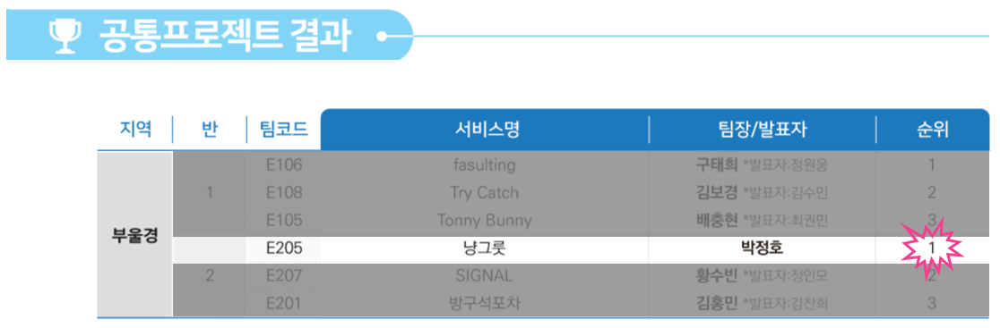

# 냥그릇 


### :sparkles: SSAFY 8기 공통 프로젝트 1등





### :bulb: UCC

[](https://youtu.be/y4wfpoJvSkw)

↑ 클릭하면 UCC를 볼 수 있어요!


## 🚩 목차

1. 기획 배경
2. 서비스 소개
3. 기능 소개
4. 시연
5. 기술 스택
6. 프로젝트 일정 및 기타 산출물


## :sparkles: 기획 배경


#### 개요

- 한 줄 설명 : 도시와 길 고양이의 공존을 위한 **길고양이 급식소** 위치 선정 ‘커뮤니티 서비스'.
- 서비스 명 : **냥그릇**


#### 목적

- **지역주민과 길 고양이의 공존**
- 급식소 위치를 사회적 합의를 통해 정함으로써 주민과 길고양이의 공존을 이룬다.


#### 현 상황

- 캣맘/캣대디의 무분별한 급식소 운영의로 개체수 파악이 어려움.
  [대구 ‘길냥이’ 생존권 두고 지자체·캣맘 갈등](https://www.idaegu.com/newsView/idg202205180035)
- 방치된 급식소와 관리되지 않은 길고양이가 쓰레기통을 뒤지거나 멸종위기 철새를 잡아먹음
  [을숙도 철새·고양이 공존 '빨간불'… 환경·동물단체 엇갈린 반응](http://www.kookje.co.kr/news2011/asp/newsbody.asp?code=0300&key=20220404.99099000739)
- 고양이에 대한 혐오와 캣맘/캣대디의 갈등
  [길고양이 밥 주지 말랬지…캣맘 무자비 폭행 당했다 이슈](https://www.hankyung.com/politics/article/2022120966267)
- 길 고양이 급식소 위치에 대한 지자체와 지역 주민들과의 갈등
  [길고양이 급식소, 찬반 논란 넘어 공존 방안 찾을 때](https://www.busan.com/view/busan/view.php?code=2021110819201372597)


## :sparkles: 서비스 소개


#### 페르소나

- 관리자 : **지자체**

  - 각각의 고양이 밥그릇 정보들(이용하는 고양이, 밥그릇 상태, 인근 주민들의 의견)을 확인할 수 있다.
  - 밥그릇 위치 추가, 수정, 삭제할 수 있다.
  - TNR 계획을 수립할 수 있고, 중성화 수술을 마친 고양이들을 사진과 함께 개시글로 작성할 수 있다.

  

- 일반 사용자 : **지역 주민** 및 **캣맘**

  - 인근의 밥그릇 (위치, 남은 사료량, 사용하는 고양이) 정보를 확인할 수 있다. 
  - 인근의 밥그릇에 대해 선호/비선호하는지 의견을 남길 수 있다.
  - 특정 밥그릇 커뮤니티에 오는 고양이에 대한 사진을 두고 자유로운 커뮤니티를 형성할 수 있다. 
  - 관리자가 작성한 TNR 현황을 볼 수 있다


#### 서비스 시퀀스

1. 인증된 관리자가 웹앱에 IoT 기기를 등록한다. ( serial num, 급식소 이름, 담당 캣맘 인적 사항, 위치)
2. 등록된 IoT 기기를 설치하고자 하는 위치에 설치 후 기기를 on 한다.
3. 설치가 완료된 IoT 기기를 사진촬영해 등록을 완료한다.
4. 설치된 기기의 serial num 과 등록된 기기의 serial num 을 비교해, 일치하면 위치, 무게 및 사진 정보 웹앱에 보낸다.(통신 시작)
5. 지역 주민은 IoT 밥그릇 지붕에 부착된 QR코드를 통해 우리 웹앱에 접근한다.
6. 지역 주민은 IoT 밥그릇 관련된 정보 및 찬반 의견, 자유로운 토론을 웹앱에서 할 수 있다. 
7. 길고양이가 IoT에 들려 밥을 먹으면 카메라 센서가 Cat을 인식 후 (open CV) 사진을 촬영해 웹앱에 보여진다.
8. 담당 캣맘이 밥을 주거나 길고양이가 밥을 먹으면 밥그릇 무게가 변하고, 이 변화 된 값이 웹앱에 업데이트 된다.
9. 변화가 없는, 관리되지 않거나 고양이가 사용하지 않는 밥그릇은 관리자에게 알린다.
10. 급식소 위치가 변화하면 변화된 위치 값이 관리자 페이지에 알려진다.


#### 기대 효과


- 지자체 주도 IoT 급식소 보급 및 양성화
- IoT 급식소를 통한 길고양이 급식소 상태 확인 및 관리
- 급식소 위치에대한 지역주민간의, 지역주민과 지자체간의 합의 및 소통


## :sparkles: 기능 소개


#### [기능 명세서](https://www.notion.so/8f1e615e739248c8bd45906a7842bda6)


#### 일반 유저 페이지 필수 기능

- 지도를 통해 고양이 급식소 위치 정보 제공
- 고양이 급식소 상태 (위치, 사료양, 급식소를 이용하는 고양이 사진) 의 상세정보 제공
- 해당 급식소 위치에 대한 시민들 의견을 조사하기 위해, 선호/비선호 투표 제공 (선호/중립/비선호 투표 및 이유)
- 고양이 급식소마다 소통할 수 있는 커뮤니티 서비스 제공


#### **관리자 페이지 필수 기능**

- 급식소 추가, 수정, 삭제 기능
- 관리하고 있는 급식소 목록 제공 및 각 급식소의 상태 조회
- 급식소 위치의 선호도 결과 및 이유 확인 가능


#### **IoT(급식소) 필수 기능** 

- GPS 기반 급식소 위치 정보 제공 (Arduino + Neo-6M)
- 무게 센서 기반 사료 양 정보 제공 (Arduino + Load cell + HX 711)
- 초음파 센서 + 카메라 + OpenCV기반 고양이 사진 필터링 기능 (Arduino + ESP32 - cam + open CV)
- QR 코드를 통한 웹앱 연결 기능


## :sparkles: 시연


##### Login & Profile


##### Pins on Map and Detail Page 


##### Vote & Community CRUD


 

##### Registration IoT Feeder


##### Show Data from IoT and Export Data to excel and png form


##### TNR Cat Post 


##### 404 Page


## :sparkles: 기술 스택


- 프론트엔드 : Bootstrap 5.3.0, AntDesign 5.0, React 5.0.1, NodeJS 18.13.0 LTS
- 백엔드 : Oracle Java 11.0.17, Spring boot 2.7.7, JPA, Swagger 2.9.2, python 3.8.0, MySQL 8.0.31

- CI/CD: Jenkins, Docker, AWS ec2
- IoT : Arduino 2.0.3

- 이슈관리 : Jira, Notion


#### 	Architecture 설계도


## :sparkles: 프로젝트 일정 및 기타 산출물


#### Gantt Chart


#### Git Flow


#### Sequence Diagram

​	**로그인 및 마이페이지 정보 수정**


​		**급식소 등록**


​		**게시글 CRUD**


#### Figma 화면 정의서


#### API Interface


#### ERD


### Coding Convention

 [자바 코딩_컨밴션.pdf](./assets/java.pdf) 

 [스프링 컨밴션.pdf](./assets/spring.pdf) 

**Frontend**

- var 대신 cosnt, let 사용
- 가능한 Arrow Function으로 함수식 작성 (변수선언과 함수를 하나로, this를 어디서 쓰든 값을 변화시키지 않음)
- 변수 명: file 상수는 UPPER_SNAKE_CASE, 그 외엔 camelCase. Boolean 변수 앞에 is 붙이기.
- 클래스(생성자) 명 : PascalCase
- 클래스(HTML) 명 : kebab-case
- Prettier, ESLint를 사용

```
# Prettier

module.exports = {
    singleQuote: true,
    // 문자열은 작은 따옴표로 통일
    semi: false,
    //코드 마지막에 세미콜른이 자동 생성 금지
    useTabs: false,
    //탭의 사용을 금하고 스페이스바 사용으로 대체
    tabWidth: 2,
    // 들여쓰기 너비는 2칸
    trailingComma: 'all',
    // 객체나 배열 키:값 뒤에 콤마 생성
    printWidth: 100,
    // 코드 한줄이 maximum 100글자
    arrowParens: 'avoid',
    // 화살표 함수가 하나의 매개변수를 받을 때 괄호 생략
};
```


#### IoT 명세서

- 한 줄 설명 : **GPS 센서**와 **무게센서**로 길고양이 급식소의 위치 및 무게 정보를 Spring 서버로 전송, **카메라 센서**로 10분마다 촬영한 사진을 FastAPI 서버로 전송 후 openCV 라이브러리를 통해 사진 속 고양이 여부를 판단해 스프링 서버로 전송한다.


**GPS 센서** 	

**Neo - 6M GPS 모듈 (1 EA)**

- 3,500원
- 1575.42Mhz
- 작동 온도 -40°C ~ 85°C
- 전압 : 3 - 5.25 V
- 소비 전력 45mA


**무게센서** 

**Load Cell 1kg모듈 (1ea)**

- 1,300원
- 80 * 12.7 * 12.7mm
- 전압 : 5 V

**HX711 무게 증폭기 (1ea)**

- 590원
- 전압 : 5V
- 소비전력 : 1.6mA


**ESP8266 Wi-Fi 모듈 (1 EA)**

- 2,300원
- 1575.42Mhz
- 작동 온도 -40°C ~ 85°C
- 전압 : 3 - 5.25 V
- 소비 전력 45mA
- 저전력 듀얼코어 32비트 CPU
- 컴퓨팅 성능 최대 600DMIPS
- 내장 520KB SRAM, 외부 8MB PSRAM
- Wi-Fi Direct (P2P), soft-AP


**카메라 센서** **ESP32 - 32 CAM (1ea)**

- 5,700원

- 저전력 듀얼코어 32비트 CPU

- 컴퓨팅 성능 최대 600DMIPS

- 내장 520KB SRAM, 외부 8MB PSRAM

- Wi-Fi Direct (P2P), soft-AP

- 전압 : 4.75 - 5.25 V

- 이미지 출력 형식 : JPEG, BMP, GRAYSCALE

- 모드별 소비 전력

- - 깊은 수면 : 6mA@5V
  - 현대 수면 : 20mA@5V
  - 가벼운 수면 : 6.7mA@5V
  - 일반 모드 : 180mA@5V
  - 플래시 켠 상태 : 310mA@5V


#### 급식소 Design

- 3d 프린터로 높이 1cm, 각 변 16.5cm 이등변 삼각 형의 모듈을 프린팅하고 케이블 타이로 묶어 지름 60cm 높이 38cm 
  지오데 식 돔을 만든다. 
- 고양이 평균 사이즈 22cm 를 고려해 23cm 높이의 개구부를 만든다. 돔 형 태로 만들어진 급식소는 지름 62cm의 플라스틱 바닥과 
  케이블 타이로 묶는다. 
- 내부공간에 추가적인 벽체를 두지 않을 수 있는 돔 형태 장점을 살려 IoT 장치를 급식소 내부에 설치할 공간 을 충분히 확보하도록 한다. 


101 : 지오데식 돔형 급식소 
102 : ESP-32-Cam 카메라 센서 
103 : Loadcell 무게 센서와 Hx711 증폭기 기반 무게 센서 
104 :Neo-6M GPS 센서와 ESP 32 와이파이 모듈 
105 : QR 코드


#### 특허출원 등록


#### [특허 명세서](https://docs.google.com/document/d/1e7OZH2Ifypg78xTVEjlkHiVbdMlfmZCZ53dlgsUZ0bg/edit?usp=sharing)


## :sparkles: 팀원 소개 및 회고


**Team Name**

​	AVENGERS


##### Ground Rules

- 매일 아침 회의 9:00 ~ 10:00 오늘 할 일, 어제 한 일(코드리뷰기반)을 공유한다 (Jira, Confluence)

- 한주에 한명씩 아침조회 서기역할을 한다.

- 주말은 자율적, 하지만 주간 일정을 다 못했다면 주에도 마무리한다.

- 개인 일정은 일정이 잡힌 날 카카오톡과 Jira에 미리 공유한다.

- 모르는 부분, 에러난 부분 숨기지말고, 솔직하게 말하기. (다 배워가는 사람임)

- 사적인 메신저 : 카카오톡, 개발 이슈 공유는 : Jira, 화면공유는 Discord, 컨설턴트님들과의 소통 : MM


**Mind Set**

- 팀원들이 밤샘을 하지 않도록 리딩을 잘 한다.

- 해보고 싶은게 있으면 주저하지 말고 꼭!!! 말한다.

- 적극적으로 팀원들과 소통한다.

- 6시안에 끝내기. 오프라인에서 최선을 다한다. (200% 역량을 발휘하자!)

- 생각하면서 코딩하기

- 서로 존중한다.

- 좋은건 공유한다.

- 불길한 분위기를 조성하지 않는다.

- 소수의 의견도 존중한다.


**Retrospect**

- [박정호](https://github.com/jaypakkorea) :  ***'받은 잔은 참고 마땅히 비워야 한다.'***  이번 프로젝트를 진행하며 몸과 마음이 힘들 때마다 되새기던 이문열의 <젊은 날의 초상> 속 문구다. 팀장으로서 능력이 뛰어난 팀원들을 만난다는 건 한편으론 행복하고 복 받은 일이지만, 다른 한 편으론 심적으로 부담스러운 일이었다. 성과가 안 나오면 팀원들에게 미안할 것 같았고, 나 스스로 많이 부끄러울 것 같아 매 순간 온 진심과 열정을 쏟았던 프로젝트였다. 우리 팀원들 모두가 나의 부족한 리더쉽에도 잘 따라와 줬고, 각자의 역할을 다해준 덕분에 결국 반 1등뿐만 아니라 해운대구청 지자체와의 협의도 잘 끌어낼 수 있었으며, 팀원들에게 개발뿐만 아니라 성격적인 면에서도 많은 것을 배울 수 있어 성과와 성장을 이룰 수 있던 기회였다. 
  개인적으론 건축, Product 디자인, 웹 디자인할 때 항상 다크한 느낌의 디자인만 해오다가 이런 밝은 느낌의 디자인을 처음 해봐 Figma 작업부터 다소 어려웠지만 좋은 경험이었고, 대학원 때 배웠던 3d 프린팅과 Geometric, Parametric 디자인 요소를 우리 프로젝트에 녹여낼 수 있어 특히 의미 있는 프로젝트였다고 평가하고 싶다. 
  그리고 이 좋은 아이디어를 여기에만 머물긴 너무나도 아깝다고 생각해, 이를 기반으로 기술적인 부분을 더 가다듬어 정말 세상에 선한 영향을 주는 제품 하나 내놓고 싶다. 
- [이미현](https://github.com/mihyeon1234) : 길고양이 급식 봉사활동을 하며 이런 기능이 있는 기계, 서비스가 있으면 좋겠다 라고 생각한 것이 현실로 우리가 기획부터 시작하여 웹페이지, iot 를 만들고, 실제 시연까지 한것이 너무 큰 경험이였던것 같습니다. 우리가 만든 서비스를 지자체에서도 실제로 원하고 있으면 좋겟다 하는것이 의미가 있는, 사회에 도움이되는 프로젝트를 만든것 같아 너무 기뻣고, 조금만 더 발전시키면 상용화 까지 가능한 아이디어, 기술을 만든것 같아 자부심을 가지게 된 프로젝트였습니다! 
- 최재원 : 좋은 팀원들과 색다르고 다양한 경험들을 하여 정말 재밌는 시간이였습니다. 정말 열심히 진행한 만큼 결과도 좋아서 매우 보람찼습니다.
- [심보현](https://github.com/scofe97) : 이런 본격적인 개발 프로젝트가 처음인 만큼 많은 점이 미숙했다고 느꼈었고, 나 자신이 많은 발전이 필요하다는걸 느끼게 되었다. 하지만 개발쪽 프로세스 전반을 프로젝트에서 다뤄본 경험과, 지자체와 연계해서 프로젝트가 실제로 긍정적인 평가를 받고, 특허까지 내는건 잊지못할 경험일거 같다. 부족한 나와 함께 해준 팀원들에게 정말로 감사하고, 즐거운 프로젝트였다.
- [양희진](https://github.com/yanghuijin1214) : SW 기술을 활용해 사회 문제를 해결하는 프로젝트를 진행하게 되었는데, 실제로 지자체와 컨택하고 진행하게 되어 뿌듯합니다. 서버 부터 백엔드, 프론트까지 다 다뤄볼 수 있어 배우는 점도 많았고, 공통 프로젝트에서 끝나지 않고 실제로 상용화될 수 있는 서비스를 개발힌 것 같아 보람찬 경험이었습니다!
- 송주영 : SW적으로 현실에 있는 문제를 해결해서 그 결과로 지자체랑 컨택도 하고 사회공헌하는 프로젝트를 하게 되어서 뿌듯했습니다. 팀원들과 같이 배우고 성장한 기간동안 즐거웠어요!

